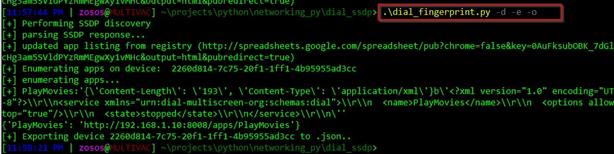

# Smart TV Shenanigans
## TV Specs 
- **Manufacturer**: Vizio
- **Model Name**: V405-G9
- **Serial #**: 03LINIYAKV09358
- **Version**: 2.50.35-6

### Software
- **Platform(s)**: VIZIO SmartCast,Chromecast built-in
- **SCPL Version**: 1.0.13
- **AirPlay Version**: 17.24.9
- **Chromium Version**: MTKB-2.0.18
- **Cast Version**: 1.140.169511

### Hardware
- **Remote Control**: XRT136
- **Built-In Wifi**: 802.11ac Dual Band
- **HDMI In**: 3
- **Ethernet In**: 1
- **USB In**: 1

## DIAL & SSDP
### Basic Terminology
- **First-screen**: a TV, Blu-ray player, set-top-box, or similar device 
- **Second-screen**: a smartphone, tablet, or similar device
- **DIAL Server**: a device implementing the server side of the DIAL protocol, usually a first-screen
device.
- **DIAL Client**: a device that can discover and launch applications on a DIAL server, usually a
second-screen device. 

### Overview
DIAL (DIscovery And Launch) is a simple protocol that allow second-screen devices like phones, tablets, etc. to discover and launch applications on a primary-screen device.

In the OSI model, DIAL is an application-layer (layer 7) protocol that borrows some features from other common applicaiton procols, such as:
 - HTTP/HTTPU 
 - SSDP/UPnP
 
 
 The DIAL protocol has two main components: 
 - **DIAL Service Discovery**: enables a DIAL client device to discover DIAL servers on its local network
segment and obtain access to the DIAL REST Service on those devices.
 - **DIAL REST Service**: enables a DIAL client to query, launch, and optionally stop applications on a
DIAL server device.

DIAL Service Discovery is achieved using a new Search Target (ST) within the SSDP protocol defined by
UPnP and an additional header in the response to an HTTP request for the UPnP device
description. In effect, DIAL service discovery can be thought of as an extension of the SSDP device discovery protocol.

DIAL application interaction takes place over DIAL REST Service on a per-app basis.
The DIAL REST service represents applications (Netflix, YouTube, etc.) as resources
identified by URLs operating through an HTTP API.
The Application Resource URL for an application is constructed by concatenating the DIAL REST
Service URL, a single slash character (‘/’) and the Application Name as identified in the official application registry.


 
 In a nutshell, the protocol operates as follows:
 1. Send multicast M-SEARCH request with a Search Target (ST) header of ```urn:dial-multiscreen-org:service:dial:1.``` 
 2. Read LOCATION header from responding GET requests revealing device description
 3. HTTP GET the LOCATION header and read the APPLICATION-URL header in the response.
 4. APP-URL is APPLICATION-URL + APP-NAME (where APP-NAME is defined in the [official registry](http://www.dial-multiscreen.org/dial-registry/namespace-database#TOC-Registered-Names) )
 5. POST to APP-URL. Include supported parameters in the body of the POST
 6. Read the LOCATION header of the POST response to get the INSTANCE-URL.
 7. DELETE to the INSTANCE-URL to stop the running app.

### dial_fingerprint.py
Basic script to identify DIAL-enabled devices on a LAN and enumerate the available apps on each device.
Gives the option to dump the DIAL device info to a JSON object to view later.

Currently does not have the ability to interact with discovered apps
#### Usage:
- **-d**: perform SSDP discovery (DIAL Discovery Service)
- **-e**: enumerate apps on discoverd devices (DIAL REST Service)
- **-o**: dump device info to file 

#### Ex:



### Visio API
DIAL is just one service running on the Visio Smart TV. Thanks to work done by [@vkorn](https://github.com/vkorn/pyvizio)
there is a python command-line client for interacting with the VISIO API.

Full API thanks to @exiva can be found [here](https://github.com/exiva/Vizio_SmartCast_API) 

### TBD
Plans going forward could include:
- Using pyvisio + scripting to fuzz VISIO API endpoints, discover vulns
- According to the official docs, DIAL must support CORS from approved application domains.. check if its securely implemented?
- Download and reverse Android Second-Screen app for Visio to better understand First-Screen API
- Attempt MiTM or Network TAP setup to capture packets from Smart TV to discover strange/hidden services
- Extend DIAL scripting capabilities to actually interact with device apps like YouTube etc.
- Investigate all other network services exposed by TV (Nmap allports returns 7/8 services)
- Investigate the DIAL default system app further (exposed through DIAL REST Service under /apps/system)

Things that might require "Adult Supervision":
- Removing the casing to see if theres potential for JTAG/UUART exploitation

### Sources:
[Dial Protocol Specs](http://www.dial-multiscreen.org/dial-protocol-specification) <br>
[UPnP Protocol Specs](https://openconnectivity.org/upnp-specs/UPnP-arch-DeviceArchitecture-v2.0-20200417.pdf)<br>
[@jcarbaugh DIAL gist](https://gist.github.com/jcarbaugh/e08dcfe61ece0e7eea12) <br>
[VISIO API](https://github.com/exiva/Vizio_SmartCast_API) <br>
[pyvisio](https://github.com/vkorn/pyvizio)

